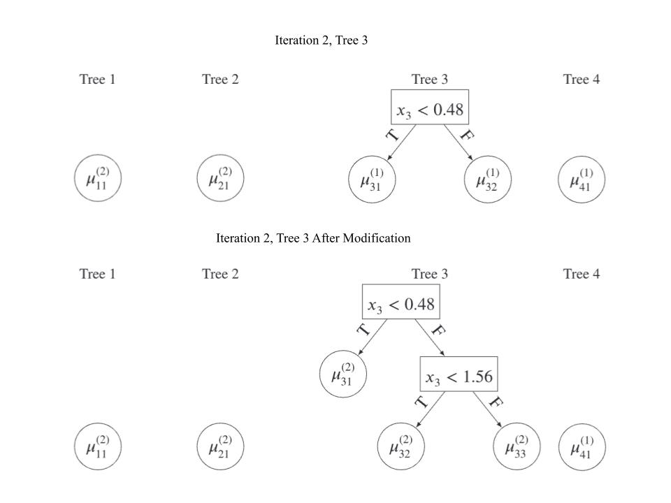
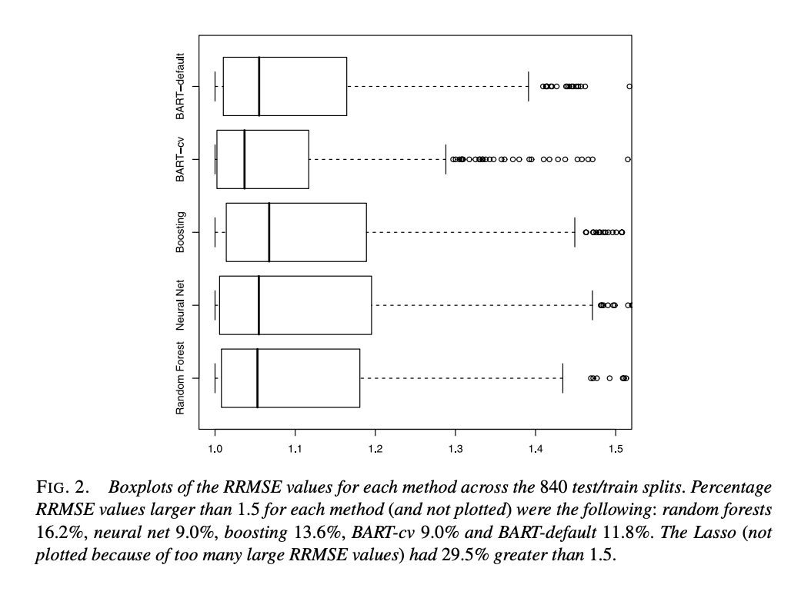
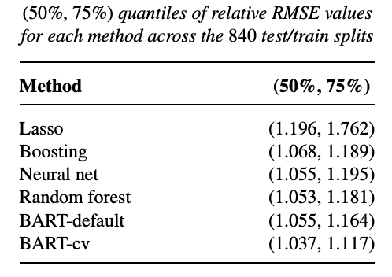
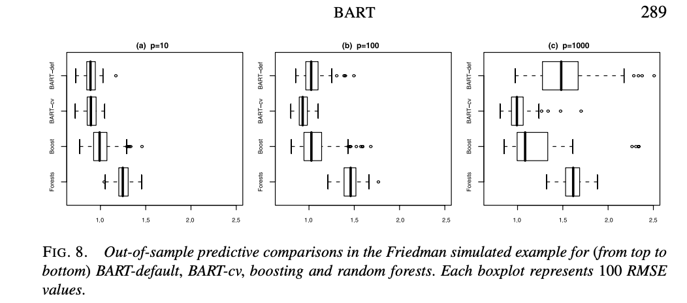
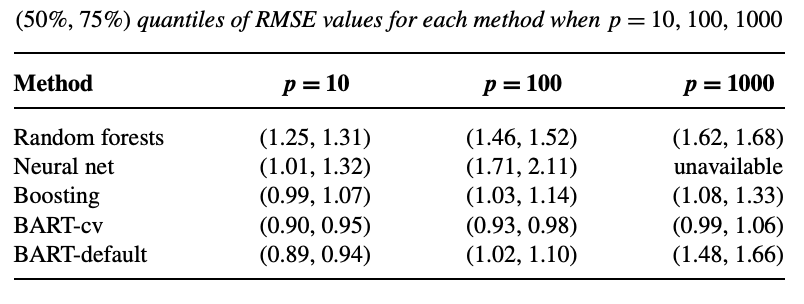

```{r setup, include=FALSE}
options(htmltools.dir.version = FALSE)
knitr::opts_chunk$set(
  fig.width=8, fig.height=2.5, fig.retina=3,
  out.width = "100%",
  cache = FALSE,
  echo = TRUE,
  comment = NA, # Kathleen added this to remove the hashtags
  message = FALSE, 
  warning = FALSE,
  hiline = TRUE
)
```

```{r xaringan-themer, include=FALSE, warning=FALSE}
library(xaringanthemer)
style_duo_accent(
  primary_color = "#1381B0",
  secondary_color = "#FF961C",
  inverse_header_color = "#FFFFFF"
)
library(ggplot2)
theme_set(theme_bw())
```

<!-- 
## Central Problem

Suppose we want to make inference for some continuous $Y$ that depends on the unknown function

$$
Y=f(\mathbf{x})+\epsilon,\quad \epsilon\sim N(0,\sigma^2)
$$
where $\mathbf{x}=(x_1,x_2,...,x_p)$. Suppose we also want to account for possible interaction and non-linear effects, and want to easily estimate the uncertainty associated with predictions.

Traditional Regression:
- Search for a polynomial that fits to the data without overfitting
- Possibly need to do other techniques, and do related cross-validation
- Is there a better way?

---

--->

## Sum Of Trees Model

We can estimate our unknown function $f(\mathbf{x})$ as a sum of the outputs of $m$ regression trees:

$$
Y \approx \sum_{j=1}^m g_j(\mathbf{x}) +\epsilon,\quad \epsilon\sim N(0,\sigma^2) 
$$
where $g_j(\mathbf{x})$ is the output of the $j$th regression tree. Note that depending on the exact model used, there may additional parameters for $g_j$. Sum-of-trees models can:

- Better account for non-linearity (step-function like)
- Easily incorporate additive components
- One tree can branch based on different parameter values, incorporating interaction effects
- Trees can be kept small (weak learners)

compared to more traditional regression or regression-like models.

---

## Overview of BART

The BART model, as first defined by Hugh A. Chipman, Edward I. George, and Robert E. McCulloch, is:

$$
Y = f(\mathbf{x})+\epsilon=\sum_{j=1}^mg(\mathbf{x}; T_j,M_j)+\epsilon,\quad \epsilon\sim N(0,\sigma^2) 
$$

where $T_j$ is the $j$th binary regression tree, consisting of interior nodes holding decision rules and $b$ terminal nodes, and $M_j=\{\mu_{j1}, \mu_{j2},\dots,\mu_{jb}\}$ is the set of parameter values associated values associated with each terminal node of $T_j$. For each $T_j$, each $\mathbf{x}$ is associated with a single terminal node value $\mu_{ji}$. Note $E(Y|\mathbf{x})$ is the sum of these chosen $\mu_{ji}$.

Trees can depend on one or many components of $\mathbf{x}$, modeling both main and interaction effects, and be of varying depths (modeling different effect strengths).

Prior distributions are placed on $T_j$, $\mu_{ji}|T_j$, and $\sigma$. A back-fitting Monte Carlo Markov Chain (MCMC) algorithm is used to fit BART, and the final output $f(\mathbf{x})$ is an average of $\mathbf{x}$ evaluated on the MCMC sample over the posterior distribution.

---

## Priors and Posteriors

The **Prior** is probability distribution assigned to a parameter before any data is observed, while the **Posterior** is the _updated_ probability distribution of a parameter given the observed values of the data. As a general example, let unknown parameter $A$ have the prior $f_A(\alpha)$. Conditional on the fact $A=\alpha$, the data $B$ has the likelihood $f_{B\mid A}(\beta\mid\alpha)$. 

The posterior distribution $f_{A\mid B}(\alpha\mid\beta)$ is given as

<div>
$$
f_{A\mid B}(\alpha\mid\beta)=\frac{f_{B\mid A}(\beta\mid\alpha)f_A(\alpha)}{f_B(\beta)}
$$
</div>

or $f_{A\mid B}(\alpha\mid\beta)\propto f_{B\mid A}(\beta\mid \alpha)f_A(\alpha)$. 

In words, $\text{Posterior}\propto \text{Likelihood}\times\text{Prior}$.

---

## Concrete Prior and Posterior Example

Suppose you wish to investigate the fairness of a coin. Let $P$ be the probability that the coin lands on heads, and $H$ be the number of heads you get when flipping the coin $n$ times. Note that $H$ has a binomial distribution, $H\sim B(n, p)$. Since you know $p$ is between 0 and 1. Thus, a reasonable prior in this scenario the uniform distribution from 0 to 1, $P\sim U(0, 1)$. 

In this scenario, we have the prior $f_P(p)=1$ and the likelihood $f_{H\mid P}(h\mid p)= \binom{n}{h}p^h (1-p)^{n-h}$. We can calculate $f_H(h)=\frac{1}{n+1}$ by integrating the likelihood by the prior with respect to $p$. 

We can calculate the posterior distribution $f(p\mid h)$:

$$
\begin{split}
f_{P|H}(p\mid h)&=\frac{f_{H\mid P}(h\mid p)f_P(p)}{f_H(h)}\\
&=(n+1)\times\binom{n}{h}p^h (1-p)^{n-h}\times1\\
f_{P|H}(p\mid h)&\propto p^h (1-p)^{n-h}
\end{split}
$$
Note that this is the beta distribution $H\sim \text{Beta}(h+1, n-h+1)$.

(Example adapted from the slides of Associate Professor Hui Wang at Brown University)
---

## Concrete Prior and Posterior Example, Continued

```{r}
ggplot(data.frame(x = c(0, 1)), aes(x = x)) +
  geom_function(fun = dbeta, args = list(shape1 = 26, shape2 = 76), aes(colour = "h = 25, n = 100")) +
  geom_function(fun = dbeta, args = list(shape1 = 101, shape2 = 101), aes(colour = "h = 100, n = 200")) +
  geom_function(fun = dbeta, args = list(shape1 = 301, shape2 = 101), aes(colour = "h = 300, n = 400")) +
  scale_colour_manual("Parameters", values = c("red", "blue", "green")) +
  labs(x = "P", y = "Density", title = "Posterior Distribution for different values of h and n")
```

---

## Further Comments on Priors and Posteriors

- Changing the prior will change the posterior, but for good data, this change is less noticeable
- The range of parameter in the prior distribution is the maximum range of the posterior distribution
- Multiplying the posterior by the proportionality constant (everything that doesn't depend on the parameter) allows it to integrate to 1.
- The posterior gives a plausible distribution of a parameter, not exact values. The mean and mode are frequently used as estimates of the true value, depending on the situation


We can calculate a $1-\alpha$ posterior interval, $[p_1, p_2]$ for the posterior distribution from our example.

The boundaries of the interval are such that

<div>
\[
P(p < p_1)=\int_{-\infty}^{p_1} f_{P\mid H}(p\mid h)\, dp=\frac{\alpha}{2}
\]
</div>

and

<div>
\[
P(p > p_2)=\int_{p_2}^{\infty} f_{P\mid H}(p\mid h)\, dp=\frac{\alpha}{2}
\]
</div>

are true, with a $1-\alpha$ probability that $p$ is located in this interval, conditional on the observed data.

---

## Prior on the Trees

The prior on $T_j$ can be specified by 3 parts:

1. The probability that a node at depth $d=0,1,\dots$ is nontermial: $\alpha(1+d)^{-\beta}$ for $\alpha\in(0,1)$ and $\beta \in [0, 1)$
2. The choice of splitting variable: uniform distribution over all possible predictors
3. The choice of splitting value: uniform distribution over all values of the chosen predictor in that node

Larger values of $\alpha$ increase the likelihood of a split, and larger values of $\beta$ decrease the number of terminal nodes. For (2), although Chipman et al. proposed the uniform distribution be used, other literature has suggested that this not ideal for variable selection.

(1) is used to control the number of splits in the tree, with an initial split probability of $\alpha$ at $d = 0$, with larger depths having a lower probability of splitting. (2) and (3) control the different combination of available splits, with larger depths having a lower possible pool of combinations.

---

## Prior on the Parameter Values

The prior on $\mu_{ji}|T_j$ is given by the normal distribution $N(\mu_\mu, \sigma^2_\mu)$.

Note that as $E(Y|\mathbf{x})=\sum_{j=1}^m\mu_{ji}|T_j$, $E(Y|\mathbf{x})\sim N(m\mu_\mu, m\sigma^2_\mu)$. $E(Y|\mathbf{x})$ can be kept in the range $(y_{\min}, y_\max)$ for $k$ standard deviations by choosing $\mu_\mu$ and $\sigma^2_\mu$ such that $m\mu_\mu \pm m\sigma^2_\mu = y_{\min}, y_\max$. While this isn't the most Bayesian approach, it ensures predictions are made that reasonably close to the training data.

If $Y$ is scaled such that $y_\min=-0.5$ and $y_\max=0.5$, then our prior becomes

$$
\mu_{ji}|T_j \sim N\left(0,\left(\frac{0.5}{k\sqrt{m}}\right)^2\right)
$$

For higher values of $m$ (more trees), the prior on individual parameters tightens, ensuring predictions don't scale with $m$ (this same affect can also be achieved by increasing $k$). Note that if you choose to scale $Y$, no scaling of any predictors are needed.

---

## Prior on the Error Variance

The prior on $\sigma^2$ is given by the inverse chi-squared distribution $\frac{\lambda \nu}{\chi^2}$, where $\nu$ is the degrees of freedom for the prior and $\lambda$ based a "rough data-based overestimate" $\hat{\sigma}$ of $\sigma$, either the sample standard deviation or the square root of the MSE (RMSE) from an OLS fit (Note the inherent assumption that BART will model the data better than OLS). 

Chimpan et al. recommend picking $\nu$ between 3 and 10, inclusive, and picking $\lambda$ such that $\hat{\sigma}$ is located at the $q$th quantile of the prior for some selected $q$; they recommend 0.75 for a conservative estimate, 0.99 for an aggressive estimate, and 0.9 as the default.

<center></center>

.footnote[From _BART: Bayesian additive regression trees_, Chipman et al.]


---

## Building the True Posterior

The selection of priors is such that each tree is independent of each other, the terminal node parameters are independent for each tree, and $\sigma$ is independent of the trees. Thus, we can write the overall regularization prior for the BART model as

<div>
\[
p((T_1,M_1),\dots,(T_m,M_m),\sigma)=\left[\prod_{j=1}^m\left[\prod_{i=1}^{b_j}p(\mu_{ji}|T_j)\right]p(T_j)\right]p(\sigma)
\]
</div>

Thus, using the formula for the posterior distribution we have:

$$
p((T_1,M_1),\dots,(T_m,M_m),\sigma\mid Y)\propto p(Y\mid(T_1,M_1),\dots,(T_m,M_m),\sigma)\times p((T_1,M_1),\dots,(T_m,M_m),\sigma)
$$

In the BART framework, we never explicitly calculate the true posterior; the distribution (all possible combinations of $m$ trees and $\sigma$ values) is too large. Instead, we search through many possible combinations of trees, and the collection of sets of $m$ trees visited forms our posterior. This type of sampling process is known as a Markov chain Monte Carlo algorithm. 

---

## Background on Sampling Process

For each iteration, we want to first draw the set $(T_j, M_j)$ for $j=1,\dots,m$ from the distribution of all other trees and associated terminal node parameters, $(T_{(j)}, M_{(j)}$, the error $\sigma$, and the data $\mathbf{y}$, then draw $\sigma$ from the distribution of all the trees and the data.

Instead of drawing from the full, true posterior, BART use a _Gibbs sampler_, an MCMC algorithm, to draw from the conditional distributions: 

<div>
\[
(T_j,M_j)\mid T_{(j)}, M_{(j)},\sigma,\mathbf{y}\ \text{ and then }\ \sigma\mid T_1,\dots,T_j,M_1,\dots,M_j,\mathbf{y}
\]
</div>

For each iteration, we first draw the set $(T_j, M_j)$ for $j=1,\dots,m$ from the distribution of all other trees and associated terminal node parameters, $(T_{(j)}, M_{(j)})$, the error $\sigma$, and the data $y$, then draw $\sigma$ from the distribution of all the trees and the data.

Note that $(T_j, M_j)$ only depends on the data and the other $m-1$ trees through the residual formula:

<div>
\[
\mathbf{R}_j=\mathbf{y}-\sum_{k\ne j}g(\mathbf{x},T_k,M_k)
\]
</div>

So we can equivalently draw from $(T_j, M_j)\mid\mathbf{R}_j,\sigma$.

---

Furthermore, the choice of the normal distribution for the prior on the terminal node parameters, allows $M_j$ to be integrated out with an exact solution as:

$$
p(T_j\mid \mathbf{R}_j,\sigma)\propto p(T_j)\int p(\mathbf{R}_j\mid M_j,T_j,\sigma)p(M_j\mid T_j,\sigma)\,dM_j
$$

Thus we draw from the distributions:

$$
T_j|\mathbf{R}_j,\sigma \ \text{ and then }\ M_j\mid T_j, \mathbf{R}_j, \sigma
$$

In words, we draw for a new tree, then for the set of leaf values for the tree.

The draw for $T_j$ utilizes the Metropolis–Hastings algorithm, another MCMC algorithm. A modified tree, $T_j^*$ is randomly proposed that differs from $T_j$ in one of 4 ways:

1. A new terminal node is grown
1. A terminal node is pruned
1. A nonterminal split rule is changed
1. A parent and child are swapped

---

The probability that $T_j^*$ is accepted is given by the Metropolis–Hastings ratio (another type of MCMC:

<div>
\[
\min\left\{1, \frac{q(T_j^*,T_j)}{q(T_j,T_j^*)} \frac{P(\mathbf{R}_j\mid \mathbf{x},T_j^*,M_j)}{P(\mathbf{R}_j\mid \mathbf{x},T_j,M_j)} \frac{P(T_j^*)}{P(T_j)} \right\}
\]
</div>

where $\frac{q(T_j^*,T_j)}{q(T_j,T_j^*)}$ is ratio of the probability of how $T_j$ moves to $T_j^*$ to the probability of how $T_j^*$ moves to $T_j$, $\frac{P(\mathbf{R}_j\mid \mathbf{x},T_j^*,M_j)}{P(\mathbf{R}_j\mid \mathbf{x},T_j,M_j)}$ is the likelihood ratio of $T_j^*$ to that of $T_j$, and $\frac{P(T_j^*)}{P(T_j)}$ is the probability of $T_j^*$ to that of $T_j$. The exact formulas used in these calculations depend both the priors and the chosen move, and have been omitted for sake of space.

If $T_j^*$ is accepted, than the structure of $T_j$ changes to that of $T_j^*$; otherwise, $T_j$ retains the same structure. Whatever the outcome, we then sample for $M_j$, drawing each $u_{ji}$ from the normal distribution

<div>
\[
\alpha(T_j, T_j^*)= N\left(\left(\sigma_\mu^2\sum r_{ji}\right)/(n_i\sigma_\mu^2+\sigma^2),\,\sigma^2\sigma_\mu^2 /[n_i\sigma_\mu^2+\sigma^2]\right)
\]
</div>

where $r_{ji}$ are the elements in $\mathbf{R}_j$ corresponding to $\mu_{ji}$ and $n_i$ is the size of $r_{ji}$. 

---

## Sample Iteration

.pull-left[

]

.pull-right[
1. Calculate $\mathbf{R}_3=\mathbf{y}-\sum_{k\ne 3}g(\mathbf{x},T_k,M_k)$
2. Randomly select grow as the new move for $T_3^*$
3. Calculate probability $\alpha(T_3, T_3^*)$
4. $T_3^*$ is selected, and replaces $T_3$
5. $\mu_{31}^{(2)}$, $\mu_{32}^{(2)}$, and $\mu_{33}^{(2)}$ are drawn

Note:
- $\mathbf{R}_3$ is calculated with Trees 1 and 2 from iteration 2 and Tree 4 from iteration 1
- Even if $T_3^*$ hadn't been selected, $M_3$ still would have been drawn for; the trees are always changing, even if the structure stays the same
- A rejected modification isn't a rejected _iteration_

Example adapted from _Bayesian additive regression trees and the General BART model_, Tan YV, Roy J
]

---

## Building the Posterior (that we actually use)

To build the posterior, we run the following algorithm for $B+K$ iterations, of which $B$ are burn-in iterations and are $K$ kept iterations:

1. For $j=1,\dots,m$:
  1. Compute $\mathbf{R}_j=\mathbf{y}-\sum_{k\ne j}g(\mathbf{x},T_k,M_k)$
  2. Randomly choose a possible modification $T_j^*$
  3. Compute $\alpha(T_j, T_j^*)$
  4. Accept $T_j^*$ with probability $\alpha(T_j, T_j^*)$
  5. Draw for $M_j$
2. Draw for $\sigma$
3. If not a burn-in iteration, store $((T_1,M_1),\dots,(T_m,M_m),\sigma)$

Assuming we've chosen a suitable $K$, the sequence of iterations can be regarded as a size-$K$ sample from the true posterior. 

Burn-in iterations are only used to start the MCMC process, and allow the sampler to reach the true posterior region. BART is often initialized with $m$ stumps, with $\mu_{j1}=\frac{\bar{Y}}{m}$.

---

To predict for a particular $\mathbf{x}^*$, we pass $\mathbf{x}^*$ into each of the $K$ iterations and take the average of all their responses:

<div>
\[
Y^*=\frac{1}{K}\sum_{k=1}^Kf_k^*(\mathbf{x}^*)
\]
</div>

where $f_K^*(\cdot)$ is the $K$th kept iteration, functioning as a single possible sum-of-trees model on the set of $m$ trees and associated terminal node parameters $(T_j^*,M_j^*)$

<div>
\[
f^*(\cdot)=\sum_{j=1}^mg(\cdot,T_j^*,M_j^*)
\]
</div>


The median of the responses may also be used. To measure uncertainty, $1-\alpha$ posterior intervals can be calculated over the whole distribution of $f_k^*(\mathbf{x}^*)$ values by taking the interval between the $\frac{\alpha}{2}$ and $1-\frac{\alpha}{2}$ quantiles.

---

## Choosing Hyperparameters

There are two recommended methods for choosing the hyperparameters $\alpha$, $\beta$ ($T_j$ prior), $k$ ($\mu_{ji}$ prior), $\nu$, $q$ ($\sigma^2$ prior), $m$, $B$, $K$, and probabilities of each possible tree modification move:

1. $k$-fold cross validation from reasonable values

2. Use recommended defaults of $\alpha = 0.95$, $\beta=2$, $k=2$, $\nu=3$, $q=0.90$, $m = 200$, $P(\text{grow})=P(\text{prune})=0.25$, $P(\text{change split condition})=0.40$, and $P(\text{swap parent and child})=0.10$
  - For $B$ and $K$, the original paper variously uses $B = 200$ & $K = 1000$, $B = 1000$ & $K=5000$, and $B=1000$ & $K=3000$ for different experiments

3. A mix of cross validation and pre-selected defaults

Using default parameters gives similar performance to other commonly used machine learning algorithms, but cross-validation for at least some parameters gives BART a noticeably better performance (particularly for large numbers of parameters).

---

.pull-left[

]

.pull-right[

]

Results are from comparing BART with default parameters ($B=200$, $K=1000$), BART with 5-fold cross validation for $k$, $\nu$, $q$, and $m$, along with selected other methods with 5-fold cross-validation. 42 different data sets were used, and RMSE measured on testing set predictions.

While BART with cross validation has the best results, BART with default parameters is comparable or better than the other methods.

.footnote[From _BART: Bayesian additive regression trees_, Chipman et al.]
---

.pull-left[

]

.pull-right[

]

Results are from comparing BART with default parameters ($B=1000$, $K=3000$), BART with 5-fold cross validation for $k$, $\nu$, $q$, and $m$, along with selected other methods with 5-fold cross-validation. Simulated data was generated from a true function that only depended on 5 predictors, but with $p$ included in the data set. 

BART with cross validation maintains consistently good performance across tested values of $p$. However, BART with default parameters declines from being the best method for $p=10$ to being one of the worst for $p=1000$. 
This is one of the major weaknesses of BART; the others are that it assumes that variance is constant for all $Y$ data, and its computationally expensive with the number of iterations and trees you have to store.

.footnote[From _BART: Bayesian additive regression trees_, Chipman et al.]
---

## When (and when not) to use BART

.pull-left[
If all of the below are true...

- Your data has non-linear and interaction effects
- Your data doesn't have a large amount of possible predictors
- Your variance is near-uniform
- You want to do minimal or no cross validation
- You want to easily quantify uncertainty
- You have at least a basic understanding of Bayesian statistics

...BART is probably a good method to try

]

.pull-right[
If any of the below are true...
- Your data has a clear linear or quadratic fit
- Your data has a very large number of possible predictors
- Your data has non-constant variance
- You want a resulting smooth curve
- You really care about execution time (i.e., seconds are important to you)
- You don't want to learn any Bayesian statistics

...BART probably isn't for you.
]


---

## To add or possibly add

Jake to add:

- BART for classification
- Developments in BART modeling since original paper
- Common use cases of BART
- BART R libraries (BART, dBART, differences between them)

<!--Extra stuff included in template, keep for now as reference-->

---
## The  **dbarts** Package

```{r}
#install.packages("dbarts")
library(dbarts)
```

There are two functions to fit a BART model
```{r, eval = F}
bart <- bart(y ~ x, data = data)
bart2 <- bart2(y ~ x, data = data)
```
Use **bart2()**
> bart() was the initial implementation while bart2 has more in depth defaults included
> bart2() supports standard (y ~ x) syntax while bart() requires matrix inputs. Additionally, bart2() implements parallelization to four chains whereas bart() does not implement parallelization

What to know about dbarts:
- keepTrees is defaulted to false. When you want to make predictions on data you don't have, switch it to true. 
- dbarts has a predict() function similar to other libraries that can be used to calculate probabilities 

---

## Important Parameters

- you can change k (end-node prior) which controls how conservative the model is. A higher k makes the model more conservative and binary models are more sensitive to these changes
- ntree/n.trees defaults to 200 for bart() and 75 for bart2())
- ndpost/n.samples controls the number of posterior draws after the initial period
- nskip/n.burn controls the number of initial MCMC iterations to discard to ensure the sampler has reached a stationary distribution

## Built-in Visualization and Diagnostics
- The **plot()** function generates a trace plot of $\sigma$ to check if the MCMC chain has converged as well as a "fitted vs. actual" plot showing the posterior intervals for f(x) (for classification problems, plot() only returns the performance plots since the standard deviation is constant)
- varcount allows you to see which variables are used most frequently in tree splits to determine variable importance


---

## Baby Example: BART for Classification

We use the `iris` dataset to predict if a flower is a **Versicolor**. This uses the **probit link** theory discussed previously to model the probability of a binary outcome. 

Below three models are fit.
- First, BART is fit on all the variables
- Next, BART is fit using on Sepal.Length and Sepal.Width
- Finally a logistic regression model is fit on all the variables for comparison

```{r}
data(iris)
set.seed(1)
iris_class <- iris
iris_class$isVersicolor <- as.numeric(iris_class$Species == "versicolor")

fit_class <- bart2(isVersicolor ~ Sepal.Length + Sepal.Width + Petal.Length + Petal.Width, 
                   data = iris_class, keepTrees = TRUE, verbose = FALSE)
reduced_fit <- bart2(isVersicolor ~ Sepal.Length + Sepal.Width, 
                     data = iris_class, keepTrees = TRUE, verbose = FALSE)
glm_fit <- glm(isVersicolor ~ Sepal.Length + Sepal.Width + Petal.Length + Petal.Width, 
               data = iris_class, family = binomial)
```

---
## Bart Visualizations
```{r, echo = F}
par(mfrow = c(1, 2))
plot(fit_class, main = "Full Model")
plot(reduced_fit, main = "Reduced Model")
```

### add analysis of the difference here

---
### Calculate Prediction Accuracies
```{r, eval=F}
# First use the predict() function in dbarts to generate predictions
bart_probs <- predict(fit_class, iris_class[, 1:4])
# Next use the colMeans() function to find the mean of each row in the matrix generated previously
bart_probs <- colMeans(bart_probs)
# If the average is greater than 0.5, it is labelled as a versicolor (1)
bart_pred <- ifelse(bart_probs > 0.5, 1, 0)

# Collect glm predictions with the same decision threshold of 0.5
glm_pred <- ifelse(predict(glm_fit, type = "response") > 0.5, 1, 0)

# Store the resulting counts of correct and incorrect predictions 
df_errors <- data.frame(
  Method = rep(c("BART", "Logistic Regression"), each = 2),
  ErrorType = rep(c("Missed Versicolors", "Wrongly Labeled"), 2),
  Count = c(
    sum(bart_pred == 0 & iris_class$isVersicolor == 1),
    sum(bart_pred == 1 & iris_class$isVersicolor == 0),
    sum(r_bart_pred == 0 & iris_class$isVersicolor == 1),
    sum(r_bart_pred == 1 & iris_class$isVersicolor == 0),
    sum(glm_pred == 0 & iris_class$isVersicolor == 1),
    sum(glm_pred == 1 & iris_class$isVersicolor == 0)
  )
)
```

---
### Using GGplot to compare the accuracies
```{r, eval=T, echo=F,  fig.height=4}
bart_probs <- predict(fit_class, iris_class[, 1:4])
bart_probs <- colMeans(bart_probs)
bart_pred <- ifelse(bart_probs > 0.5, 1, 0)

r_bart_probs <- predict(reduced_fit, iris_class[, 1:4])
r_bart_probs <- colMeans(r_bart_probs)
r_bart_pred <- ifelse(r_bart_probs > 0.5, 1, 0)

glm_pred  <- ifelse(predict(glm_fit, type = "response") > 0.5, 1, 0)

df_errors <- data.frame(
  Method = rep(c("BART (Full)", "BART (Sepal Only)", "GLM (Full)"), each = 2),
  ErrorType = rep(c("Missed Versicolors", "Wrongly Labeled"), 3),
  Count = c(
    sum(bart_pred == 0 & iris_class$isVersicolor == 1),
    sum(bart_pred == 1 & iris_class$isVersicolor == 0),
    sum(r_bart_pred == 0 & iris_class$isVersicolor == 1),
    sum(r_bart_pred == 1 & iris_class$isVersicolor == 0),
    sum(glm_pred == 0 & iris_class$isVersicolor == 1),
    sum(glm_pred == 1 & iris_class$isVersicolor == 0)
  )
)
ggplot(df_errors, aes(x = Method, y = Count, fill = ErrorType)) +
  geom_bar(stat = "identity", position = "dodge", color = "black") + 
  scale_fill_manual(values = c("Missed Versicolors" = "darkred", "Wrongly Labeled" = "navy")) +
  geom_text(aes(label = Count), position = position_dodge(width = 0.9), vjust = -0.5) +
  labs(title = "Classification Mistakes", x = "", y = "Count") +
  theme_bw()
```
---
## Classification: Quantitative Results

We evaluate performance using Accuracy, Misclassification Rate, Precision, and Recall. While both models perform well on the `iris` data, BART's **sum-of-trees** structure provides a robust alternative to the linear assumptions of Logistic Regression.

```{r, echo=FALSE}

df_plot_class <- data.frame(
  Actual    = factor(iris_class$isVersicolor, levels = c(0, 1)),
  BART_Prob = as.numeric(bart_probs),
  GLM_Prob  = as.numeric(predict(glm_fit, type = "response"))
)
df_plot_class$BART_Pred <- factor(ifelse(df_plot_class$BART_Prob > 0.5, 1, 0), levels = c(0, 1))
df_plot_class$GLM_Pred  <- factor(ifelse(df_plot_class$GLM_Prob > 0.5, 1, 0), levels = c(0, 1))

bart_table <- table(Actual = df_plot_class$Actual, Predicted = df_plot_class$BART_Pred)
glm_table  <- table(Actual = df_plot_class$Actual, Predicted = df_plot_class$GLM_Pred)

get_metrics <- function(tab) {
  tn <- tab[1,1]; fp <- tab[1,2]; fn <- tab[2,1]; tp <- tab[2,2]
  accuracy <- (tp + tn) / sum(tab)
  precision <- ifelse((tp + fp) > 0, tp / (tp + fp), 0)
  recall    <- ifelse((tp + fn) > 0, tp / (tp + fn), 0)
  return(c(Accuracy = accuracy, Precision = precision, Recall = recall))
}

metrics_list <- list(
  `BART (Full)`  = get_metrics(table(Actual = iris_class$isVersicolor, Predicted = bart_pred)),
  `BART (Sepal)` = get_metrics(table(Actual = iris_class$isVersicolor, Predicted = r_bart_pred)),
  `GLM (Full)`   = get_metrics(table(Actual = iris_class$isVersicolor, Predicted = glm_pred))
)

comparison_df <- data.frame(
  Metric = c("Accuracy (TP+TN)", "Precision (TP/TP+FP)", "Recall (TP/TP+FN)"),
  `BART_Full`  = as.character(scales::percent(unname(metrics_list[[1]]), accuracy = 0.1)),
  `BART_Reduced` = as.character(scales::percent(unname(metrics_list[[2]]), accuracy = 0.1)),
  `GLM_Full`   = as.character(scales::percent(unname(metrics_list[[3]]), accuracy = 0.1))
)

knitr::kable(comparison_df, format = "html", 
             caption = "BART vs. GLM", row.names=F)

```

The full bart model shows around 98% accuracy and position. This makes sense given it has the petal data. Without the petal data, the reduced BART model only identifies versicolors around 80% of the time and how more false positives than in the full model. Even with less data, the reduced BART model still performs significantly better than the generalized regression model. 

---


## Baby Example: BART vs Boosting (mtcars)

We compare two tree-based methods:
- **Boosting (GBM)**
- **BART (Bayesian Additive Regression Trees)**

Goal:
- Predict mpg and compare training vs testing error

## Step 1: Train/Test Split

```{r  echo=TRUE, results='hide'}
## Step 1: Train/Test Split {.smaller}
```

```{r, echo=TRUE, results='hide'}
# Load the packages we need:
# BART for Bayesian Additive Regression Trees
# gbm for boosting
#install.packages("BART")
library(BART)
#install.packages("gbm")
library(gbm)

# Set a seed so the random split is reproducible
set.seed(123)

# Load the mtcars dataset
data(mtcars)

# Count the total number of observations
n <- nrow(mtcars)

# Randomly choose about 70% of the rows for training
train_idx <- sample(1:n, size = floor(0.7 * n))

# Create training and testing sets
train <- mtcars[train_idx, ]
test  <- mtcars[-train_idx, ]

# Build predictor matrices for BART
# We remove mpg because that is the response variable
x_train <- as.matrix(train[, -1])
y_train <- train$mpg

x_test <- as.matrix(test[, -1])
y_test <- test$mpg

```
---

## Step 2: Boosting and BART Model
```{r  echo=TRUE, results='hide'}
# Set the number of boosting iterations (trees)
n_trees <- 200

# Fit the boosting model
# This is a regression problem, so distribution = "gaussian"
boost_model <- gbm(
  mpg ~ .,
  data = train,
  distribution = "gaussian",
  n.trees = n_trees,
  interaction.depth = 2,
  shrinkage = 0.05,
  bag.fraction = 1.0,
  n.minobsinnode = 2,
  verbose = FALSE
)

# Create vectors to store training and testing error at each tree
boost_train_err <- numeric(n_trees)
boost_test_err  <- numeric(n_trees)

# Loop through the trees one at a time
# At each step, compute train and test MSE
for (i in 1:n_trees) {
  pred_train <- predict(boost_model, train, n.trees = i)
  pred_test  <- predict(boost_model, test,  n.trees = i)

  boost_train_err[i] <- mean((y_train - pred_train)^2)
  boost_test_err[i]  <- mean((y_test - pred_test)^2)
}

# Fit the BART model
# x.test is included so BART also produces test predictions
bart_model <- wbart(
  x.train = x_train,
  y.train = y_train,
  x.test  = x_test,
  ndpost  = 200
)

# Extract posterior prediction matrices
bart_train_mat <- bart_model$yhat.train
bart_test_mat  <- bart_model$yhat.test

# Make sure the matrices are oriented correctly:
# rows = posterior draws, columns = observations
if (ncol(bart_train_mat) == length(y_train)) {
  bart_train_draws <- bart_train_mat
} else {
  bart_train_draws <- t(bart_train_mat)
}

if (ncol(bart_test_mat) == length(y_test)) {
  bart_test_draws <- bart_test_mat
} else {
  bart_test_draws <- t(bart_test_mat)
}

# Count the number of posterior draws
n_draws <- nrow(bart_train_draws)

# Create vectors to store BART training and testing error
bart_train_err <- numeric(n_draws)
bart_test_err  <- numeric(n_draws)

# For each posterior draw, compute the train and test MSE
for (i in 1:n_draws) {
  bart_train_err[i] <- mean((y_train - bart_train_draws[i, ])^2)
  bart_test_err[i]  <- mean((y_test - bart_test_draws[i, ])^2)
}

# Smooth the BART error curves using cumulative averages
# This makes the Bayesian draws easier to compare visually
bart_train_err_smooth <- cumsum(bart_train_err) / seq_along(bart_train_err)
bart_test_err_smooth  <- cumsum(bart_test_err) / seq_along(bart_test_err)
```
---

- will likely follow similar format to the classification example
- making sure to follow guidelines in rubric and cover all our bases
=======
## Step 3: Error Comparison
```{r, echo=FALSE,  fig.width=7, fig.height=3.5,  out.width="50%"}

plot(boost_train_err, type = "l",
     col = "blue", lwd = 2,
     ylim = range(c(boost_train_err, boost_test_err,
                    bart_train_err_smooth, bart_test_err_smooth)),
     xlab = "Iterations / Draws",
     ylab = "Mean Squared Error",
     main = "BART vs Boosting: Train and Test Error")

lines(boost_test_err, col = "blue", lty = 2, lwd = 2)
lines(bart_train_err_smooth, col = "orange", lwd = 2)
lines(bart_test_err_smooth, col = "orange", lty = 2, lwd = 2)

legend("topright",
       legend = c("Boosting Train", "Boosting Test",
                  "BART Train", "BART Test"),
       col = c("blue", "blue", "orange", "orange"),
       lty = c(1, 2, 1, 2),
       lwd = 2)
```       

In boosting, the training error decreases rapidly toward zero, while the test error stops improving, indicating overfitting. In contrast, BART maintains similar training and testing error levels, and the errors stabilize after early iterations, suggesting better generalization.

- **BART is less aggressive than boosting:**
- It does not drive training error to zero
- It maintains a competitive test error
- It generalizes better to new data

---

## Main Example: Fetal Health Dataset

In childbirth, there are a slurry of complications that can occur.  To best prevent these complications, constant monitoring of the fetus can help detect any issues early on which can protect the mother/baby throughout the whole process.

This can be done with a Cardiotogram (CTG).  A CTG uses ultrasound waves to capture various metrics of a fetus, including fetal heartbeat, fetal movement, and uterine contractions.  

Additionally, the data gives a "health score" for each fetus to determine their risk level.  For this specific dataset, health levels are defined as follows:
**1: Normal | 2: Suspect | 3: Pathological**

Ayres de Campos et al. (2000) SisPorto 2.0 A Program for Automated Analysis of Cardiotocograms. J Matern Fetal Med 5:311-318

The data can be viewed here: https://drive.google.com/drive/u/1/folders/1AP13V0-5hTJb7Yuz2BjG6O9Ak_VTppIy

---

## Data Dictionary

Going forward, these variables will be relevant for this problem:

```{r, echo=FALSE}
dictionaryDF <- data.frame(
  Variable = c("Abnormal Short Term Variability","Accelerations", "Baseline Value", "Fetal Movement", "Decelerations", "Uterine Contractions", "Health Score"),
  Description   = c("Percentage of time the fetal heart rate exhibits reduced beat-to-beat variability","Number of Times Heartrate is 15 BPM Over Baseline Value per Second", "Baseline Heartrate Level", "Number of Distinct Fetal Movements per Second", "Number of Times Heartrate is 15 BPM Under Baseline Value per Second", "Number of Uterine Contractions per Second", "Score Representing the current Health Status of a Fetus"),
  Type = c("Integer", "Float", "Integer", "Integer", "Integer", "Float", "Integer (1, 2, or 3)") 
)

knitr::kable(dictionaryDF, format = "html", 
             caption = "Fetal Health Data Dictionary")
```

---

## Running BART Model

To begin the dataset needs to be cleaned of missing values, followed by assigning our predictor and response variables.

After, BART can be run to answer the following question: **Can the given CTG Metrics correctly classify if a given fetus is at high risk (Health Score of 2 or 3)?**

```{r echo=TRUE}
fetalCSV <- read.csv("fetal_health.csv")
fetalCSV <- na.omit(fetalCSV)

# Changes Score to 2-Dimensional with 0= Normal and 1 = Needs Care (Suspect/Pathological)
fetalCSV$Target <- ifelse(fetalCSV$fetal_health > 1, 1, 0)

set.seed(1)
# 70% Training / 30% Testing
train_indices = sample(1:nrow(fetalCSV), 0.7 * nrow(fetalCSV))

train_df = fetalCSV[train_indices, ]
test_df  = fetalCSV[-train_indices, ]

bart_model = bart2(Target ~ baseline.value + accelerations + fetal_movement + 
                     light_decelerations + uterine_contractions + abnormal_short_term_variability, 
                   data = train_df, keepTrees = TRUE, verbose = FALSE)
```

---

**Now that the model has been run, predictions can be made and the accuracy can be found:**

```{r}

bart_raw_preds  = predict(bart_model, newdata = test_df)
bart_prob_preds = colMeans(bart_raw_preds)

# Using the standard 0.5 threshold 
bart_preds = ifelse(bart_prob_preds > 0.5, 1, 0)

bart_errors <- data.frame(
  Method = rep(c("Normal Fetuses", "High Risk Fetuses"), each = 2),
  ErrorType = rep(c("Correctly Labeled", "Incorrectly Labeled"), 1),
  Count = c(
    sum(bart_preds == 0 & test_df$Target == 0), sum(bart_preds == 1 & test_df$Target == 0),
    sum(bart_preds == 1 & test_df$Target == 1), sum(bart_preds == 0 & test_df$Target == 1)
  )
)

bart_errors
```

---

## Visualizing BART's Accuracy

```{r, echo=FALSE, fig.height=4}
ggplot(bart_errors, aes(x = Method, y = Count, fill = ErrorType)) +
  geom_bar(stat = "identity", position = "dodge", color = "black") + 
  scale_fill_manual(values = c("Correctly Labeled" = "navy", "Incorrectly Labeled" = "darkred")) +
  geom_text(aes(label = Count), position = position_dodge(width = 0.9), vjust = -0.5) +
  labs(title = "Classification Mistakes", x = "", y = "Count") +
  theme_bw()
```

---

## Other Metrics

In addition to visualizing the raw number of correct and incorrect classifications, this can be expanded on to get the percentage accuracy.

```{r}
totalAccuracy = (sum(bart_preds == 0 & test_df$Target == 0) + 
                   sum(bart_preds == 1 & test_df$Target == 1)) / length(test_df$Target)
cat("Overall Model Accuracy:", totalAccuracy)
```

```{r}
normalAccuracy = sum(bart_preds == 0 & test_df$Target == 0) / length(which(test_df$Target == 0))
cat("Normal Fetus Accuracy:", normalAccuracy)
```

```{r}
hrAccuracy = sum(bart_preds == 1 & test_df$Target == 1) / length(which(test_df$Target == 1))
cat("High Risk Fetus Accuracy:", hrAccuracy)
```

---

## Establishins a Benchmark Model

We used random forest as a comparison model to evaluate how well BART performs with this particular dataset.

Random forest is a strong baseline because it: 

- Handles nonlinear relationships
- Captures interactions between variables
- Is known for stable performance on classification problems

```{r}
library(randomForest)

fetalCSV <- read.csv("fetal_health.csv")
fetalCSV <- na.omit(fetalCSV)

# Changes Score to 2-Dimensional with 0= Normal and 1 = Needs Care (Suspect/Pathological)
fetalCSV$Target <- ifelse(fetalCSV$fetal_health > 1, 1, 0)

set.seed(1)
# 70% Training / 30% Testing
train_indices = sample(1:nrow(fetalCSV), 0.7 * nrow(fetalCSV))

train_df = fetalCSV[train_indices, ]
test_df  = fetalCSV[-train_indices, ]

rf_model = randomForest(
  as.factor(Target) ~ baseline.value + accelerations + fetal_movement + 
    light_decelerations + uterine_contractions + abnormal_short_term_variability,
  data = train_df,
  ntree = 500
)
```

---

## Generating Predictions

```{r}
rf_prob_preds = predict(rf_model, newdata = test_df, type = "prob")[,2]

# Using the standard 0.5 threshold 
rf_preds = ifelse(rf_prob_preds > 0.5, 1, 0)

rf_errors <- data.frame(
  Method = rep(c("Normal Fetuses", "High Risk Fetuses"), each = 2),
  ErrorType = rep(c("Correctly Labeled", "Incorrectly Labeled"), 1),
  Count = c(
    sum(rf_preds == 0 & test_df$Target == 0), sum(rf_preds == 1 & test_df$Target == 0),
    sum(rf_preds == 1 & test_df$Target == 1), sum(rf_preds == 0 & test_df$Target == 1)
  )
)
rf_errors
```

---

## Visualizing Random Forest Accuracy

```{r}
ggplot(rf_errors, aes(x = Method, y = Count, fill = ErrorType)) +
  geom_bar(stat = "identity", position = "dodge", color = "black") + 
  scale_fill_manual(values = c("Correctly Labeled" = "navy", "Incorrectly Labeled" = "darkred")) +
  geom_text(aes(label = Count), position = position_dodge(width = 0.9), vjust = -0.5) +
  labs(title = "Classification Mistakes", x = "", y = "Count") +
  theme_bw()
```

---

## Other Metrics

```{r}
rf_totalAccuracy = (sum(rf_preds == 0 & test_df$Target == 0) + 
                      sum(rf_preds == 1 & test_df$Target == 1)) / length(test_df$Target)
cat("Overall Model Accuracy:", rf_totalAccuracy)
```

```{r}
rf_normalAccuracy = sum(rf_preds == 0 & test_df$Target == 0) / length(which(test_df$Target == 0))
cat("Normal Fetus Accuracy:", rf_normalAccuracy)

```

```{r}
rf_hrAccuracy = sum(rf_preds == 1 & test_df$Target == 1) / length(which(test_df$Target == 1))
cat("High Risk Fetus Accuracy:", rf_hrAccuracy)

```

---

## BART vs Random Forest Comparison

```{r}
comparison <- data.frame(
  Model = c("BART", "Random Forest"),
  Overall_Accuracy = c(totalAccuracy, rf_totalAccuracy),
  Normal_Accuracy = c(normalAccuracy, rf_normalAccuracy),
  HighRisk_Accuracy = c(hrAccuracy, rf_hrAccuracy)
)

comparison
```

Random Forest is the better model for this dataset, suggesting the underlying relationships are not complex. Although BART is designed to capture complex linear structure, the higher performance of Random Forest suggests the data is relatively stable and does not require as much model flexibility.

---
exclude: true
## Typography

Text can be **bold**, _italic_, ~~strikethrough~~, or `inline code`.

[Link to another slide](#colors).

---
exclude: true
### Lorem Ipsum

Dolor imperdiet nostra sapien scelerisque praesent curae metus facilisis dignissim tortor. 
Lacinia neque mollis nascetur neque urna velit bibendum. 
Himenaeos suspendisse leo varius mus risus sagittis aliquet venenatis duis nec.

- Dolor cubilia nostra nunc sodales

- Consectetur aliquet mauris blandit

- Ipsum dis nec porttitor urna sed

---
exclude: true
name: colors

## Colors

.left-column[
Text color

[Link Color](#3)

**Bold Color**

_Italic Color_

`Inline Code`
]

.right-column[
Lorem ipsum dolor sit amet, [consectetur adipiscing elit (link)](#3), 
sed do eiusmod tempor incididunt ut labore et dolore magna aliqua. 
Erat nam at lectus urna.
Pellentesque elit ullamcorper **dignissim cras tincidunt (bold)** lobortis feugiat. 
_Eros donec ac odio tempor_ orci dapibus ultrices. 
Id porta nibh venenatis cras sed felis eget velit aliquet.
Aliquam id diam maecenas ultricies mi.
Enim sit amet 
`code_color("inline")`
venenatis urna cursus eget nunc scelerisque viverra.
]

---
exclude: true
# Big Topic or Inverse Slides `#`

## Slide Headings `##`

### Sub-slide Headings `###`

#### Bold Call-Out `####`

This is a normal paragraph text. Only use header levels 1-4.

##### Possible, but not recommended `#####`

###### Definitely don't use h6 `######`

---
exclude: true
# Left-Column Headings

.left-column[
## First

## Second

## Third
]

.right-column[
Dolor quis aptent mus a dictum ultricies egestas.

Amet egestas neque tempor fermentum proin massa!

Dolor elementum fermentum pharetra lectus arcu pulvinar.
]

---
exclude: true
class: inverse center middle

# Topic Changing Interstitial

--
exclude: true
```
class: inverse center middle
```

---
exclude: true
layout: true

## Blocks

---
exclude: true
### Blockquote

> This is a blockquote following a header.
>
> When something is important enough, you do it even if the odds are not in your favor.

---
exclude: true
### Code Blocks

#### R Code

```{r eval=FALSE}
ggplot(gapminder) +
  aes(x = gdpPercap, y = lifeExp, size = pop, color = country) +
  geom_point() +
  facet_wrap(~year)
```

#### JavaScript

```js
var fun = function lang(l) {
  dateformat.i18n = require('./lang/' + l)
  return true;
}
```

---
exclude: true
### More R Code

```{r eval=FALSE}
dplyr::starwars %>% dplyr::slice_sample(n = 4)
```

---
exclude: true
```{r message=TRUE, eval=requireNamespace("cli", quietly = TRUE)}
cli::cli_alert_success("It worked!")
```

--
exclude: true
```{r message=TRUE}
message("Just a friendly message")
```

--
exclude: true
```{r warning=TRUE}
warning("This could be bad...")
```

--
exclude: true
```{r error=TRUE}
stop("I hope you're sitting down for this")
```


---
exclude: true
layout: true

## Tables

---

exclude: `r if (requireNamespace("tibble", quietly=TRUE)) "false" else "true"`
exclude: true
```{r eval=requireNamespace("tibble", quietly=TRUE)}
tibble::as_tibble(mtcars)
```

---
exclude: true
```{r}
knitr::kable(head(mtcars), format = 'html')
```

---
exclude: true
```{r}
DT::datatable(head(mtcars), fillContainer = FALSE, options = list(pageLength = 4))
```

---
exclude: true
layout: true

## Lists

---
exclude: true
.pull-left[
#### Here is an unordered list:

*   Item foo
*   Item bar
*   Item baz
*   Item zip
]

.pull-right[

#### And an ordered list:

1.  Item one
1.  Item two
1.  Item three
1.  Item four
]

---
exclude: true
### And a nested list:

- level 1 item
  - level 2 item
  - level 2 item
    - level 3 item
    - level 3 item
- level 1 item
  - level 2 item
  - level 2 item
  - level 2 item
- level 1 item
  - level 2 item
  - level 2 item
- level 1 item

---
exclude: true
### Nesting an ol in ul in an ol

- level 1 item (ul)
  1. level 2 item (ol)
  1. level 2 item (ol)
    - level 3 item (ul)
    - level 3 item (ul)
- level 1 item (ul)
  1. level 2 item (ol)
  1. level 2 item (ol)
    - level 3 item (ul)
    - level 3 item (ul)
  1. level 4 item (ol)
  1. level 4 item (ol)
    - level 3 item (ul)
    - level 3 item (ul)
- level 1 item (ul)

---
exclude: true
layout: true

## Plots

---
exclude: true
```{r plot-example, eval=requireNamespace("ggplot2", quietly=TRUE)}
library(ggplot2)
(g <- ggplot(mpg) + aes(hwy, cty, color = class) + geom_point())
```

---
exclude: true
```{r plot-example-themed, eval=requireNamespace("showtext", quietly=TRUE) && requireNamespace("ggplot2", quietly=TRUE)}
g + xaringanthemer::theme_xaringan(text_font_size = 16, title_font_size = 18) +
  ggtitle("A Plot About Cars")
```

.footnote[Requires `{showtext}`]

---
exclude: true
layout: false

## Square image

<center></center>

.footnote[GitHub Octocat]

---
exclude: true
### Wide image


.footnote[Wide images scale to 100% slide width]

---
exclude: true
## Two images

.pull-left[

]

.pull-right[

]

---
exclude: true
### Definition lists can be used with HTML syntax.

<dl>
<dt>Name</dt>
<dd>Godzilla</dd>
<dt>Born</dt>
<dd>1952</dd>
<dt>Birthplace</dt>
<dd>Japan</dd>
<dt>Color</dt>
<dd>Green</dd>
</dl>

---
exclude: true
class: center, middle

# Thanks!

Slides created via the R packages:

[**xaringan**](https://github.com/yihui/xaringan)<br>
[gadenbuie/xaringanthemer](https://github.com/gadenbuie/xaringanthemer)

The chakra comes from [remark.js](https://remarkjs.com), [**knitr**](http://yihui.name/knitr), and [R Markdown](https://rmarkdown.rstudio.com).


