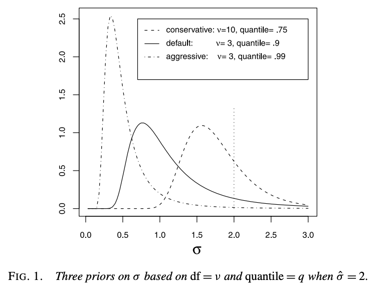

```{r setup, include=FALSE}
options(htmltools.dir.version = FALSE)
knitr::opts_chunk$set(
  fig.width=8, fig.height=2.5, fig.retina=3,
  out.width = "100%",
  cache = FALSE,
  echo = TRUE,
  comment = NA, # Kathleen added this to remove the hashtags
  message = FALSE, 
  warning = FALSE,
  hiline = TRUE
)
```

```{r xaringan-themer, include=FALSE, warning=FALSE}
library(xaringanthemer)
style_duo_accent(
  primary_color = "#1381B0",
  secondary_color = "#FF961C",
  inverse_header_color = "#FFFFFF"
)
library(ggplot2)
theme_set(theme_bw())
```

## Central Problem

Suppose we want to make inference for some continuous $Y$ that depends on the unknown function

$$
Y=f(\mathbf{x})+\epsilon,\quad \epsilon\sim N(0,\sigma^2)
$$
where $\mathbf{x}=(x_1,x_2,...,x_p)$. Suppose we also want to account for possible interaction and non-linear effects, and want to easily estimate the uncertainty associated with predictions.

Traditional Regression:
- Search for a polynomial that fits to the data without overfitting
- Possibly need to do other techniques (LOESS, splines, etc.), and do related cross-validation
- Is there a better way?

---

## Sum Of Trees Model

We can estimate our unknown function $f(\mathbf{x})$ as a sum of the outputs of $m$ regression trees:

$$
Y \approx \sum_{j=1}^m g_j(\mathbf{x}) +\epsilon,\quad \epsilon\sim N(0,\sigma^2) 
$$
where $g_j(\mathbf{x})$ is the output of the $j$th regression tree. Note that depending on the exact model used, there may additional parameters for $g_j$. Sum-of-trees models can:

- Better account for non-linearity (step-function like)
- Easily incorporate additive components
- One tree can branch based on different parameter values, incorporating interaction effects
- Trees can be kept small (weak learners)

compared to more traditional regression or regression-like models.

---

## Overview of BART

The BART model, as first defined by Hugh A. Chipman, Edward I. George, and Robert E. McCulloch, is:

$$
Y = f(\mathbf{x})+\epsilon=\sum_{j=1}^mg(\mathbf{x}; T_j,M_j)+\epsilon,\quad \epsilon\sim N(0,\sigma^2) 
$$

where $T_j$ is the $j$th binary regression tree, consisting of interior nodes holding decision rules and $b$ terminal nodes, and $M_j=\{\mu_{j1}, \mu_{j2},\dots,\mu_{jb}\}$ is the set of parameter values associated values associated with each terminal node of $T_j$. For each $T_j$, each $\mathbf{x}$ is associated with a single terminal node value $\mu_{ji}$. Note $E(Y|\mathbf{x})$ is the sum of these chosen $\mu_{ji}$.

Trees can depend on one or many components of $\mathbf{x}$, modeling both main and interaction effects, and be of varying depths (modeling different effect strengths).

Prior distributions are placed on $T_j$, $\mu_{ji}|T_j$, and $\sigma$. A back-fitting Monte Carlo Markov Chain (MCMC) algorithm is used to fit BART, and the final output $f(\mathbf{x})$ is an average of $\mathbf{x}$ evaluated on the MCMC sample over the posterior distribution.

---

## Priors and Posteriors

The **Prior** is probability distribution assigned to a parameter before any data is observed, while the **Posterior** is the _updated_ probability distribution of a parameter given the observed values of the data. As a general example, let unknown parameter $A$ have the prior $f_A(\alpha)$. Conditional on the fact $A=\alpha$, the data $B$ has the likelihood $f_{B\mid A}(\beta\mid\alpha)$. 

The posterior distribution $f_{A\mid B}(\alpha\mid\beta)$ is given as

<div>
$$
f_{A\mid B}(\alpha\mid\beta)=\frac{f_{B\mid A}(\beta\mid\alpha)f_A(\alpha)}{f_B(\beta)}
$$
</div>

or $f_{A\mid B}(\alpha\mid\beta)\propto f_{B\mid A}(\beta\mid \alpha)f_A(\alpha)$. 

In words, $\text{Posterior}\propto \text{Likelihood}\times\text{Prior}$.

---

## Concrete Prior and Posterior Example

Suppose you wish to investigate the fairness of a coin. Let $P$ be the probability that the coin lands on heads, and $H$ be the number of heads you get when flipping the coin $n$ times. Note that $H$ has a binomial distribution, $H\sim B(n, p)$. Since you know $p$ is between 0 and 1. Thus, a reasonable prior in this scenario the uniform distribution from 0 to 1, $P\sim U(0, 1)$. 

In this scenario, we have the prior $f_P(p)=1$ and the likelihood $f_{H\mid P}(h\mid p)= \binom{n}{h}p^h (1-p)^{n-h}$. We can calculate $f_H(h)=\frac{1}{n+1}$ by integrating the likelihood by the prior with respect to $p$. 

We can calculate the posterior distribution $f(p\mid h)$:

$$
\begin{split}
f_{P|H}(p\mid h)&=\frac{f_{H\mid P}(h\mid p)f_P(p)}{f_H(h)}\\
&=(n+1)\times\binom{n}{h}p^h (1-p)^{n-h}\times1\\
f_{P|H}(p\mid h)&\propto p^h (1-p)^{n-h}
\end{split}
$$
Note that this is the beta distribution $H\sim \text{Beta}(h+1, n-h+1)$.

(Example adapted from the slides of Associate Professor Hui Wang at Brown University)
---

## Concrete Prior and Posterior Example, Continued

```{r}
ggplot(data.frame(x = c(0, 1)), aes(x = x)) +
  geom_function(fun = dbeta, args = list(shape1 = 26, shape2 = 76), aes(colour = "h = 25, n = 100")) +
  geom_function(fun = dbeta, args = list(shape1 = 101, shape2 = 101), aes(colour = "h = 100, n = 200")) +
  geom_function(fun = dbeta, args = list(shape1 = 301, shape2 = 101), aes(colour = "h = 300, n = 400")) +
  scale_colour_manual("Parameters", values = c("red", "blue", "green")) +
  labs(x = "P", y = "Density", title = "Posterior Distribution for different values of h and n")
```

---

## Further Comments on Priors and Posteriors

- Changing the prior will change the posterior, but for good data, this change is less noticeable
- The range of parameter in the prior distribution is the maximum range of the posterior distribution
- Multiplying the posterior by the proportionality constant (everything that doesn't depend on the parameter) allows it to integrate to 1.
- The posterior gives a plausible distribution of a parameter, not exact values. The mean and mode are frequently used as estimates of the true value, depending on the situation


We can calculate a $1-\alpha$ posterior interval, $[p_1, p_2]$ for the posterior distribution from our example.

The boundaries of the interval are such that

<div>
\[
P(p < p_1)=\int_{-\infty}^{p_1} f_{P\mid H}(p\mid h)\, dp=\frac{\alpha}{2}
\]
</div>

and

<div>
\[
P(p > p_2)=\int_{p_2}^{\infty} f_{P\mid H}(p\mid h)\, dp=\frac{\alpha}{2}
\]
</div>

are true, with a $1-\alpha$ probability that $p$ is located in this interval, conditional on the observed data.

---

## Prior on the Trees

The prior on $T_j$ can be specified by 3 parts:

1. The probability that a node at depth $d=0,1,\dots$ is nontermial: $\alpha(1+d)^{-\beta}$ for $\alpha\in(0,1)$ and $\beta \in [0, 1)$
2. The choice of splitting variable: uniform distribution over all possible predictors
3. The choice of splitting value: uniform distribution over all values of the chosen predictor in that node

Larger values of $\alpha$ increase the likelihood of a split, and larger values of $\beta$ decrease the number of terminal nodes. For (2), although Chipman et al. proposed the uniform distribution be used, other literature has suggested that this not ideal for variable selection.

(1) is used to control the number of splits in the tree, with an initial split probability of $\alpha$ at $d = 0$, with larger depths having a lower probability of splitting. (2) and (3) control the different combination of available splits, with larger depths having a lower possible pool of combinations.

---

## Prior on the Parameter Values

The prior on $\mu_{ji}|T_j$ is given by the normal distribution $N(\mu_\mu, \sigma^2_\mu)$.

Note that as $E(Y|\mathbf{x})=\sum_{j=1}^m\mu_{ji}|T_j$, $E(Y|\mathbf{x})\sim N(m\mu_\mu, m\sigma^2_\mu)$. $E(Y|\mathbf{x})$ can be kept in the range $(y_{\min}, y_\max)$ for $k$ standard deviations by choosing $\mu_\mu$ and $\sigma^2_\mu$ such that $m\mu_\mu \pm m\sigma^2_\mu = y_{\min}, y_\max$. While this isn't the most Bayesian approach, it ensures predictions are made that reasonably close to the training data.

If $Y$ is scaled such that $y_\min=-0.5$ and $y_\max=0.5$, then our prior becomes

$$
\mu_{ji}|T_j \sim N\left(0,\left(\frac{0.5}{k\sqrt{m}}\right)^2\right)
$$

For higher values of $m$ (more trees), the prior on individual parameters tightens, ensuring predictions don't scale with $m$ (this same affect can also be achieved by increasing $k$). Note that if you choose to scale $Y$, no scaling of any predictors are needed.

---

## Prior on the Error Variance

The prior on $\sigma^2$ is given by the inverse chi-squared distribution $\frac{\lambda \nu}{\chi^2}$, where $\nu$ is the degrees of freedom for the prior and $\lambda$ based a "rough data-based overestimate" $\hat{\sigma}$ of $\sigma$, either the sample standard deviation or the square root of the MSE from an OLS fit (Note the inherent assumption that BART will model the data better than OLS). 

Chimpan et al. recommend picking $\nu$ between 3 and 10, inclusive, and picking $\lambda$ such that $\hat{\sigma}$ is located at the $q$th quantile of the prior for some selected $q$; they recommend 0.75 for a conservative estimate, 0.99 for an aggressive estimate, and 0.9 as the default.

<center></center>

.footnote[From BART: Bayesian additive regression trees, Chipman et al.]


---

## Building the True Posterior

The selection of priors is such that each tree is independent of each other, the terminal node parameters are independent for each tree, and $\sigma$ is independent of the trees. Thus, we can write the overall regularization prior for the BART model as

<div>
\[
p((T_1,M_1),\dots,(T_m,M_m),\sigma)=\left[\prod_{j=1}^m\left[\prod_{i=1}^{b_j}p(\mu_{ji}|T_j)\right]p(T_j)\right]p(\sigma)
\]
</div>

Thus, using the formula for the posterior distribution we have:

$$
p((T_1,M_1),\dots,(T_m,M_m),\sigma\mid Y)\propto p(Y\mid(T_1,M_1),\dots,(T_m,M_m),\sigma)\times p((T_1,M_1),\dots,(T_m,M_m),\sigma)
$$

In the BART framework, we never explicitly calculate the true posterior; the distribution (all possible combinations of $m$ trees and $\sigma$ values) is too large. Instead, we search through many possible combinations of trees, and the collection of sets of $m$ trees visited forms our posterior. 

---

## Background on Sampling Process

For each iteration, we want to first draw the set $(T_j, M_j)$ for $j=1,\dots,m$ from the distribution of all other trees and associated terminal node parameters, $(T_{(j)}, M_{(j)}$, the error $\sigma$, and the data $\mathbf{y}$, then draw $\sigma$ from the distribution of all the trees and the data.

Instead of drawing from the full, true posterior, BART use a _Gibbs sampler_ to draw from the conditional distributions: 

$$
(T_j,M_j)\mid T_{(j)}, M_{(j)},\sigma,\mathbf{y}\ \text{ and then }\ \sigma\mid T_1,\dots,T_j,M_1,\dots,M_j,\mathbf{y}
$$

For each iteration, we first draw the set $(T_j, M_j)$ for $j=1,\dots,m$ from the distribution of all other trees and associated terminal node parameters, $(T_{(j)}, M_{(j)}$, the error $\sigma$, and the data $y$, then draw $\sigma$ from the distribution of all the trees and the data.

Note that $(T_j, M_j)$ only depends on the data and the other $m-1$ trees through the residual formula:

$$
\mathbf{R}_j=\mathbf{y}-\sum_{k\ne j}g(\mathbf{x},T_k,M_k)
$$

So we can equivalently draw from $(T_j, M_j)\mid\mathbf{R}_j,\sigma$. Furthermore, the choice of the normal distribution for the prior on the terminal node parameters, allows $M_j$ to be integrated out with an exact solution as:

$$
p(T_j\mid \mathbf{R}_j,\sigma)\propto p(T_j)\int p(\mathbf{R}_j\mid M_j,T_j,\sigma)p(M_j\mid T_j,\sigma)\,dM_j
$$

Thus we draw from the distributions:

$$
T_j|\mathbf{R}_j,\sigma \ \text{ and then }\ M_j\mid T_j, \mathbf{R}_j, \sigma
$$

---

## Sample Iteration

---

## Building Posterior We actually use


---

## Choosing Hyperparameters

There are two recommended methods for choosing the hyperparameters $\alpha$, $\beta$ ($T_j$ prior), $k$ ($\mu_{ji}$ prior), $\nu$, $q$ ($\sigma^2$ prior), and $m$:

1. Cross validation from reasonable values

2. Use recommended defaults of $\alpha = 0.95$, $\beta=2$, $k=2$, $\nu=3$, $q=0.90$, and $m = 200$

We'll show later that using the recommended default hyperparameters achieves similar results as for cross-validation. 

---

## To add or possibly add

To add:

- Monte Carlo Markov Chain process, explained by going through an iteration for a single tree; include Gibbs sampler, calculating residuals, Metropolis-Hastings suggestion for tree updates
- Output from BART: posterior distribution (how its generated), posterior intervals
- Common Default Parameter choices, show evidence of why these are good
- Choosing your own parameters, and how you would go about doing so
- Limitations (high computational time, difficultly with large sets of parameters, lack of power to find which variables have predictive power)
- Common Use cases
- When would you want to use BART vs when you wouldn't want to use it

May add:

- Example of tree used for regression (diagram)
- Modifications to BART algorithm that other researchers have done since the BART was first introduced (this would be just a list, not in depth at ALL)

Assuming everything takes 1 slide, thats 13 slides to add, plus 2 may add. Again, not accounting for any of my bullets that we brake up into multiple slides or anything else that we add
<!--Extra stuff included in template, keep for now as reference-->

---

## Baby Example: BART for Classification

We use the `iris` dataset to predict if a flower is a **Versicolor**. This uses the **probit link** theory discussed previously to model the probability of a binary outcome.

```{r}
library(dbarts)
data(iris)

iris_class <- iris
iris_class$isVersicolor <- as.numeric(iris_class$Species == "versicolor")

# Fitting BART for classification
fit_class <- bart(x.train = iris_class[, 1:4], 
                  y.train = iris_class$isVersicolor, 
                  keepevery = 10, verbose = FALSE)

# Store posterior means (probabilities)
bart_probs <- colMeans(fit_class$yhat.train)

# Fit Logistic Regression for comparison
glm_fit <- glm(isVersicolor ~ Sepal.Length + Sepal.Width + Petal.Length + Petal.Width, 
               data = iris_class, family = binomial)

```

---
BART uses **regularization via priors** to capture non-linear boundaries. While both models perform well, we can visualize where they differ in "decisiveness" and error types.

```{r, eval=F}
# Predictions at 0.5 threshold
bart_pred <- ifelse(bart_probs > 0.5, 1, 0)
glm_pred <- ifelse(predict(glm_fit, type = "response") > 0.5, 1, 0)

df_errors <- data.frame(
  Method = rep(c("BART", "Logistic Regression"), each = 2),
  ErrorType = rep(c("Missed Versicolors", "Wrongly Labeled"), 2),
  Count = c(
    sum(bart_pred == 0 & iris_class$isVersicolor == 1),
    sum(bart_pred == 1 & iris_class$isVersicolor == 0),
    sum(glm_pred == 0 & iris_class$isVersicolor == 1),
    sum(glm_pred == 1 & iris_class$isVersicolor == 0)
  )
)

ggplot(df_errors, aes(x = Method, y = Count, fill = ErrorType)) +
  geom_bar(stat = "identity", position = "dodge", color = "black") + 
  scale_fill_manual(values = c("Missed Versicolors" = "darkred", "Wrongly Labeled" = "navy")) +
  geom_text(aes(label = Count), position = position_dodge(width = 0.9), vjust = -0.5) +
  labs(title = "Classification Mistakes", x = "", y = "Count") +
  theme_bw()
```
---
```{r, eval=T, echo=F,  fig.height=4.5}
# Predictions at 0.5 threshold
bart_pred <- ifelse(bart_probs > 0.5, 1, 0)
glm_pred <- ifelse(predict(glm_fit, type = "response") > 0.5, 1, 0)

df_errors <- data.frame(
  Method = rep(c("BART", "Logistic Regression"), each = 2),
  ErrorType = rep(c("Missed Versicolors", "Wrongly Labeled"), 2),
  Count = c(
    sum(bart_pred == 0 & iris_class$isVersicolor == 1),
    sum(bart_pred == 1 & iris_class$isVersicolor == 0),
    sum(glm_pred == 0 & iris_class$isVersicolor == 1),
    sum(glm_pred == 1 & iris_class$isVersicolor == 0)
  )
)

ggplot(df_errors, aes(x = Method, y = Count, fill = ErrorType)) +
  geom_bar(stat = "identity", position = "dodge", color = "black") + 
  scale_fill_manual(values = c("Missed Versicolors" = "darkred", "Wrongly Labeled" = "navy")) +
  geom_text(aes(label = Count), position = position_dodge(width = 0.9), vjust = -0.5) +
  labs(title = "Classification Mistakes", x = "", y = "Count") +
  theme_bw()
```
---
## Classification: Quantitative Results

We evaluate performance using Accuracy, Misclassification Rate, Precision, and Recall. While both models perform well on the `iris` data, BART's **sum-of-trees** structure provides a robust alternative to the linear assumptions of Logistic Regression.
```{r, echo = F}
df_plot_class <- data.frame(
  Actual = as.factor(iris_class$isVersicolor),
  BART_Prob = bart_probs, 
  GLM_Prob = predict(glm_fit, type = "response")
)

library(tidyr)
library(ggplot2)

# Convert probabilities to binary predictions (Threshold = 0.5)
df_plot_class$BART_Pred <- ifelse(df_plot_class$BART_Prob > 0.5, 1, 0)
df_plot_class$GLM_Pred <- ifelse(df_plot_class$GLM_Prob > 0.5, 1, 0)

# Calculate Accuracy
bart_acc <- mean(df_plot_class$BART_Pred == iris_class$isVersicolor)
glm_acc <- mean(df_plot_class$GLM_Pred == iris_class$isVersicolor)

# Create a simple dataframe for the barplot
df_acc <- data.frame(
  Method = c("BART", "Logistic Regression"),
  Accuracy = c(bart_acc, glm_acc)
)
get_metrics <- function(tab) {
  tp <- tab[2,2] # True Positive
  tn <- tab[1,1] # True Negative
  fp <- tab[1,2] # False Positive
  fn <- tab[2,1] # False Negative
  
  accuracy <- (tp + tn) / sum(tab)
  misclassification <- (fp + fn) / sum(tab)
  precision <- tp / (tp + fp)
  recall <- tp / (tp + fn) # Also known as True Positive Rate
  
  return(c(Accuracy = accuracy, Misclass = misclassification, 
           Precision = precision, Recall = recall))
}

```
```{r classification-metrics, echo=FALSE}
# Calculate Confusion Matrices
bart_table <- table(Actual = df_plot_class$Actual, Predicted = df_plot_class$BART_Pred)
glm_table  <- table(Actual = df_plot_class$Actual, Predicted = df_plot_class$GLM_Pred)

# Calculate metrics using your function
metrics_list <- list(
  BART = get_metrics(bart_table),
  GLM  = get_metrics(glm_table)
)

# Format for display
comparison_df <- data.frame(
  Metric = c("Accuracy", "Misclassification Rate", "Precision", "True Positive Rate (Recall)"),
  BART   = scales::percent(metrics_list$BART, accuracy = 0.1),
  GLM    = scales::percent(metrics_list$GLM, accuracy = 0.1)
)

knitr::kable(comparison_df, format = "html", caption = "Performance Comparison: BART vs. GLM")
```

---

## Baby Example: BART for Regression

#### Dataset:
```{r eval=FALSE}
# load the dataset here
```

- will likely follow similar format to the classification example
- making sure to follow guidlines in rubric and cover all our bases

---


---
exclude: true
## Typography

Text can be **bold**, _italic_, ~~strikethrough~~, or `inline code`.

[Link to another slide](#colors).

---
exclude: true
### Lorem Ipsum

Dolor imperdiet nostra sapien scelerisque praesent curae metus facilisis dignissim tortor. 
Lacinia neque mollis nascetur neque urna velit bibendum. 
Himenaeos suspendisse leo varius mus risus sagittis aliquet venenatis duis nec.

- Dolor cubilia nostra nunc sodales

- Consectetur aliquet mauris blandit

- Ipsum dis nec porttitor urna sed

---
exclude: true
name: colors

## Colors

.left-column[
Text color

[Link Color](#3)

**Bold Color**

_Italic Color_

`Inline Code`
]

.right-column[
Lorem ipsum dolor sit amet, [consectetur adipiscing elit (link)](#3), 
sed do eiusmod tempor incididunt ut labore et dolore magna aliqua. 
Erat nam at lectus urna.
Pellentesque elit ullamcorper **dignissim cras tincidunt (bold)** lobortis feugiat. 
_Eros donec ac odio tempor_ orci dapibus ultrices. 
Id porta nibh venenatis cras sed felis eget velit aliquet.
Aliquam id diam maecenas ultricies mi.
Enim sit amet 
`code_color("inline")`
venenatis urna cursus eget nunc scelerisque viverra.
]

---
exclude: true
# Big Topic or Inverse Slides `#`

## Slide Headings `##`

### Sub-slide Headings `###`

#### Bold Call-Out `####`

This is a normal paragraph text. Only use header levels 1-4.

##### Possible, but not recommended `#####`

###### Definitely don't use h6 `######`

---
exclude: true
# Left-Column Headings

.left-column[
## First

## Second

## Third
]

.right-column[
Dolor quis aptent mus a dictum ultricies egestas.

Amet egestas neque tempor fermentum proin massa!

Dolor elementum fermentum pharetra lectus arcu pulvinar.
]

---
exclude: true
class: inverse center middle

# Topic Changing Interstitial

--
exclude: true
```
class: inverse center middle
```

---
exclude: true
layout: true

## Blocks

---
exclude: true
### Blockquote

> This is a blockquote following a header.
>
> When something is important enough, you do it even if the odds are not in your favor.

---
exclude: true
### Code Blocks

#### R Code

```{r eval=FALSE}
ggplot(gapminder) +
  aes(x = gdpPercap, y = lifeExp, size = pop, color = country) +
  geom_point() +
  facet_wrap(~year)
```

#### JavaScript

```js
var fun = function lang(l) {
  dateformat.i18n = require('./lang/' + l)
  return true;
}
```

---
exclude: true
### More R Code

```{r eval=FALSE}
dplyr::starwars %>% dplyr::slice_sample(n = 4)
```

---
exclude: true
```{r message=TRUE, eval=requireNamespace("cli", quietly = TRUE)}
cli::cli_alert_success("It worked!")
```

--
exclude: true
```{r message=TRUE}
message("Just a friendly message")
```

--
exclude: true
```{r warning=TRUE}
warning("This could be bad...")
```

--
exclude: true
```{r error=TRUE}
stop("I hope you're sitting down for this")
```


---
exclude: true
layout: true

## Tables

---

exclude: `r if (requireNamespace("tibble", quietly=TRUE)) "false" else "true"`
exclude: true
```{r eval=requireNamespace("tibble", quietly=TRUE)}
tibble::as_tibble(mtcars)
```

---
exclude: true
```{r}
knitr::kable(head(mtcars), format = 'html')
```

---
exclude: true
```{r}
DT::datatable(head(mtcars), fillContainer = FALSE, options = list(pageLength = 4))
```

---
exclude: true
layout: true

## Lists

---
exclude: true
.pull-left[
#### Here is an unordered list:

*   Item foo
*   Item bar
*   Item baz
*   Item zip
]

.pull-right[

#### And an ordered list:

1.  Item one
1.  Item two
1.  Item three
1.  Item four
]

---
exclude: true
### And a nested list:

- level 1 item
  - level 2 item
  - level 2 item
    - level 3 item
    - level 3 item
- level 1 item
  - level 2 item
  - level 2 item
  - level 2 item
- level 1 item
  - level 2 item
  - level 2 item
- level 1 item

---
exclude: true
### Nesting an ol in ul in an ol

- level 1 item (ul)
  1. level 2 item (ol)
  1. level 2 item (ol)
    - level 3 item (ul)
    - level 3 item (ul)
- level 1 item (ul)
  1. level 2 item (ol)
  1. level 2 item (ol)
    - level 3 item (ul)
    - level 3 item (ul)
  1. level 4 item (ol)
  1. level 4 item (ol)
    - level 3 item (ul)
    - level 3 item (ul)
- level 1 item (ul)

---
exclude: true
layout: true

## Plots

---
exclude: true
```{r plot-example, eval=requireNamespace("ggplot2", quietly=TRUE)}
library(ggplot2)
(g <- ggplot(mpg) + aes(hwy, cty, color = class) + geom_point())
```

---
exclude: true
```{r plot-example-themed, eval=requireNamespace("showtext", quietly=TRUE) && requireNamespace("ggplot2", quietly=TRUE)}
g + xaringanthemer::theme_xaringan(text_font_size = 16, title_font_size = 18) +
  ggtitle("A Plot About Cars")
```

.footnote[Requires `{showtext}`]

---
exclude: true
layout: false

## Square image

<center></center>

.footnote[GitHub Octocat]

---
exclude: true
### Wide image


.footnote[Wide images scale to 100% slide width]

---
exclude: true
## Two images

.pull-left[

]

.pull-right[

]

---
exclude: true
### Definition lists can be used with HTML syntax.

<dl>
<dt>Name</dt>
<dd>Godzilla</dd>
<dt>Born</dt>
<dd>1952</dd>
<dt>Birthplace</dt>
<dd>Japan</dd>
<dt>Color</dt>
<dd>Green</dd>
</dl>

---
exclude: true
class: center, middle

# Thanks!

Slides created via the R packages:

[**xaringan**](https://github.com/yihui/xaringan)<br>
[gadenbuie/xaringanthemer](https://github.com/gadenbuie/xaringanthemer)

The chakra comes from [remark.js](https://remarkjs.com), [**knitr**](http://yihui.name/knitr), and [R Markdown](https://rmarkdown.rstudio.com).


